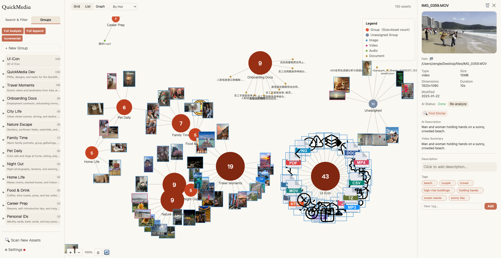

# QuickMedia

## 你的本地 AI 知识中枢 — 照片、视频、文档一网打尽

把杂乱的媒体文件夹变成智能知识库。用本地 AI 搜索、整理和理解你的文件。

<p align="center">
  
</p>

[English](README.md) | 中文

本地素材管理工具 — 扫描、标签、AI 分析、语义搜索、素材群组。

## ✨ 核心功能

### 🧠 AI 驱动的媒体理解

QuickMedia 使用多模态 AI 模型理解你的本地文件。

自动分析：

- 🖼️ **图片** — 生成描述、标签，理解视觉内容
- 🎬 **视频** — 分析关键帧，理解视频内容
- 📄 **文档** — 提取摘要和重要关键词
- 🔤 **OCR** — 识别图片中的文字
- 🎵 **音频 & 视频** — 语音转文字
- 📝 **AI 摘要** — 总结转录内容和提取信息

你的文件可按含义搜索，不仅仅是文件名。

支持多种 AI 提供商：

- 本地 AI 模型（Ollama）
- OpenAI 兼容 API
- DeepSeek / OpenRouter / MiniMax
- Whisper 语音识别模型


### 📂 智能素材管理

自动整理和索引你日益增长的媒体库。

功能：

- 扫描文件夹并自动索引文件
- 通过内容哈希检测重复文件
- 实时监控文件变化
- 提取图片、视频、音频和文档的元数据
- 异步生成缩略图
- 管理素材而不修改原始文件

你的原始文件保持不动。QuickMedia 只为它们建立智能索引。


### 🔍 自然语言搜索

按文件含义查找，不仅仅是文件名。

支持：

- AI 嵌入驱动的语义搜索
- 关键词搜索
- 结合语义和传统搜索的混合搜索
- 中文文本理解
- 搜索结果高亮
- 相似素材发现

示例：

"小狗在户外玩耍的照片"

"关于人工智能的文档"

"日本旅行的视频"


### 🏷️ 智能标签系统

用灵活的标签整理素材。

支持：

- AI 生成的标签
- 系统生成的标签
- 用户创建的标签
- 基于标签的筛选
- 批量标签管理

标签与 AI 搜索配合，提升素材发现能力。


### 🧩 AI 驱动的素材组织

将数千个散乱文件变成有意义的集合。

QuickMedia 自动发现素材之间的关系，创建智能群组。

功能：

- AI 自动聚类
- 创建自定义集合
- 素材可属于多个集合
- AI 辅助集合扩展
- 手动组织和编辑

示例：

旅行
├── 中国旅行
└── 家庭旅行

宠物
├── 狗狗
└── 户外活动


### 🕸️ 媒体知识图谱

通过关系探索你的数字记忆。

QuickMedia 可视化以下元素之间的连接：

- 图片
- 视频
- 文档
- 主题
- 集合

功能：

- 交互式力导向图
- 展开和折叠关系
- 可视化素材分组
- 搜索高亮
- 多种视图：
  - 云图
  - 网格
  - 列表

你的媒体库变成个人知识图谱。


### 🎯 高级筛选和管理

快速找到和管理你需要的内容。

筛选条件：

- 文件类型：
  - 图片
  - 视频
  - 音频
  - 文档
- 日期范围
- 文件格式
- AI 分析状态
- 标签
- 搜索相关性

附加工具：

- 批量操作
- 重新分析
- 多种排序选项
- 最常用素材排名


### 🤖 AI 代理集成（MCP）

通过 AI 助手控制 QuickMedia。

内置 MCP 支持提供以下工具：

- 素材搜索
- 素材管理
- 集合管理
- 文件夹扫描
- 标签操作
- 统计信息
- AI 重新分析

兼容：

- Claude Desktop
- Codex CLI
- Hermes


### 🌐 现代 Web 界面

全功能本地 Web 应用。

包含：

- 素材面板
- 设置管理
- 素材详情查看器
- 文档预览
- 高清缩略图
- 搜索和筛选界面
- 批量操作
- 多语言支持：
  - 英语
  - 中文

## 安装

### 快速安装（macOS/Linux）

```bash
chmod +x scripts/setup.sh && ./scripts/setup.sh
# 已安装后快速启动：
chmod +x scripts/serve.sh && ./scripts/serve.sh
```

### 基础环境

- Python 3.11+
- ffmpeg（视频元数据、缩略图提取）

```bash
# macOS
brew install ffmpeg

# Linux (Debian/Ubuntu)
sudo apt install ffmpeg

# Windows
# 下载 https://ffmpeg.org/download.html 或 winget install ffmpeg
```

### Python 包安装

核心依赖（必装）：Pillow、PyYAML、watchdog

```bash
python3 -m venv .venv
source .venv/bin/activate
pip install -e ".[all]"   # 安装全部功能包
```

可选按需安装，替代 `[all]`：

```bash
pip install -e ".[web]"        # Web UI（FastAPI + Uvicorn）
pip install -e ".[audio]"      # 语音转录（Whisper）
pip install -e ".[text]"       # 文档解析（PyMuPDF + openpyxl）
pip install -e ".[embedding]"  # 语义搜索 + 群组（ChromaDB + jieba）
pip install -e ".[mcp]"        # MCP 工具接口
```

### 前端构建

需要 Node.js。构建一次即可，产物在 `frontend/dist/` 下，运行时无需 Node。

```bash
cd frontend && npm install && npm run build && cd ..
```

### AI 模型（可选）

需要 Ollama 或其他兼容服务。未配置时 AI 分析/搜索功能不可用，素材管理、扫描功能正常。

```bash
# macOS
brew install ollama
ollama serve &

# Linux
curl -fsSL https://ollama.com/install.sh | sh

# Windows
# 下载 https://ollama.com/download/windows
```

拉取模型：
```bash
ollama pull qwen3.5:9b              # 视觉/文本分析
ollama pull qwen3-embedding:8b      # 语义搜索嵌入
```

## 启动

```bash
quickmedia serve
```

首次启动会自动弹出配置页面，添加监控文件夹后即可扫描。

## MCP 集成

### Hermes

```yaml
# ~/.hermes/config.yaml
mcp_servers:
  quickmedia:
    command: "quickmedia"
    args: ["mcp"]
```

### Claude Desktop

```json
{
  "mcpServers": {
    "quickmedia": {
      "command": "quickmedia",
      "args": ["mcp"]
    }
  }
}
```

### Codex CLI

```bash
codex mcp add quickmedia -- quickmedia mcp
```

## 支持的模型

通过 Web UI 设置页 → 模型管理配置。不同分析任务可绑定不同模型。

| Provider | 模型 | 图片 | 视频 | 音频 | 文本 |
|----------|------|:----:|:----:|:----:|:----:|
| **Ollama** (本地) | `qwen3.5:9b` | ✓ | ✓ | | ✓ |
| | `qwen3-embedding:8b` | | | | 嵌入 |
| **OpenAI** | `gpt-4o` | ✓ | | | ✓ |
| | `gpt-4o-mini` | ✓ | | | ✓ |
| | `gpt-5.5` | ✓ | | | ✓ |
| | `gpt-5.4` | ✓ | | | ✓ |
| **DeepSeek** | `deepseek-chat` | | | | ✓ |
| | `deepseek-reasoner` | | | | ✓ |
| | `deepseek-v4-flash` | | | | ✓ |
| | `deepseek-v4-pro` | | | | ✓ |
| **OpenRouter** | `openai/gpt-4o` | ✓ | | | ✓ |
| | `openai/gpt-4o-mini` | ✓ | | | ✓ |
| | `anthropic/claude-sonnet-4` | ✓ | | | ✓ |
| | `anthropic/claude-haiku-4` | | | | ✓ |
| | `google/gemini-2.5-flash` | ✓ | ✓ | ✓ | ✓ |
| | `google/gemini-2.5-pro` | ✓ | ✓ | ✓ | ✓ |
| | `deepseek/deepseek-chat` | | | | ✓ |
| | `deepseek/deepseek-v4-pro` | | | | ✓ |
| | `deepseek/deepseek-r1` | | | | ✓ |
| | `qwen/qwen3.5-plus-02-15` | ✓ | ✓ | | ✓ |
| | `qwen/qwen3.5-max` | ✓ | ✓ | | ✓ |
| | `qwen/qwen3.5-coder` | | | | ✓ |
| | `qwen/qwen3.7-plus` | ✓ | ✓ | | ✓ |
| | `qwen/qwen3.7-max` | ✓ | ✓ | | ✓ |
| | `qwen/qwen3-embedding-8b` | | | | 嵌入 |
| | `openai/whisper-large-v3` | | | ✓ | |
| | `openai/whisper-large-v3-turbo` | | | ✓ | |
| | `qwen/qwen3-asr-flash` | | | ✓ | |
| | `anthropic/claude-haiku-4.5` | ✓ | | | ✓ |
| | `anthropic/claude-opus-4.7` | ✓ | | | ✓ |
| | `anthropic/claude-opus-4.8` | ✓ | | | ✓ |
| | `anthropic/claude-sonnet-4.6` | ✓ | | | ✓ |
| | `anthropic/claude-sonnet-5` | ✓ | | | ✓ |
| | `google/gemini-3-flash` | ✓ | ✓ | ✓ | ✓ |
| | `google/gemini-3.5-flash` | ✓ | ✓ | ✓ | ✓ |
| **MiniMax** | `MiniMax-M3` | | | | ✓ |
| | `MiniMax-M2.7` | | | | ✓ |
| | `MiniMax-M2.5` | | | | ✓ |
| | `MiniMax-M2.1` | | | | ✓ |
| | `MiniMax-M2` | | | | ✓ |
| | `MiniMax-M1` | | | | ✓ |
| **Whisper** (本地) | `small` | | | ✓ | |

> 嵌入模型用于语义搜索和素材群组。图片/视频分析需要多模态模型。各 Provider 需要配置对应的 API Key。

## 数据存储

- 数据库：`~/.asset-manager/data.db`
- 配置文件：`~/.asset-manager/config.yaml`
- 模型目录：`~/.asset-manager/models.yaml`
- Prompt 模板：`~/.asset-manager/prompts.yaml`
- 向量库：`~/.asset-manager/chroma_db/`
- 缩略图：`~/.asset-manager/thumbnails/`

## 项目结构

```
quickmedia/
├── quickmedia/           # Python 后端
│   ├── api/server.py     # FastAPI 路由
│   ├── aggregation/      # 群组模块（prompts/worker/api）
│   ├── database.py       # SQLite + 迁移
│   ├── scanner.py        # 文件扫描器
│   ├── search.py         # 语义搜索
│   ├── mcp_server.py     # MCP 服务（21 工具）
│   ├── ai.py             # AI 分析器
│   ├── cli.py            # CLI 入口
│   └── ...
├── frontend/             # React 前端
│   └── src/
│       ├── App.tsx       # 主组件
│       ├── GraphView.tsx # 云图视图
│       ├── NodePanel.tsx # 群组群组面板
│       ├── AddAssetModal.tsx  # 添加/移除素材弹框
│       ├── Toast.tsx      # 消息提示
│       ├── ConfirmModal.tsx # 确认弹框
│       └── ...
├── tests/                # Pytest 测试
└── docs/v*/              # 版本文档（plan/PRD/design/tasks）
```

## 开发

```bash
# 运行测试
python -m pytest tests/ -q

# 前端开发模式
cd frontend && npm run dev

# 前端测试
cd frontend && npx vitest run
```

> ⚠️ 修改前端代码后，必须运行 `npm run build` 并将 `frontend/dist/` 提交到 Git。仓库内的 dist 是其他用户直接使用的构建产物，不更新会导致其他用户看到旧版 UI。
